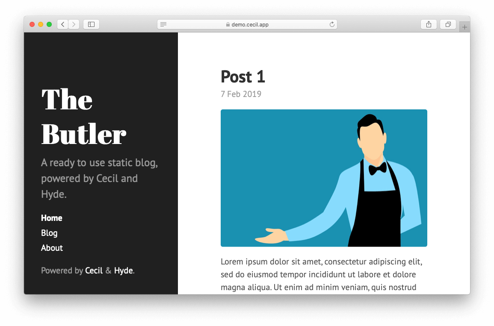

# The Butler

> A ready to use static blog, powered by [Cecil](https://cecil.app).



## There is a demo?

:arrow_forward: [the-butler-demo.cecil.app](https://the-butler-demo.cecil.app) (theme: [Hyde](https://github.com/Cecilapp/theme-hyde#readme), host: [Netlify](https://www.netlify.com))  
:arrow_forward: [the-butler-garth.vercel.app](https://the-butler-garth.vercel.app) (theme: [Garth](https://github.com/Cecilapp/theme-garth#readme), host: [Vercel](https://vercel.com))

## How to use?

### Managing content

#### Manually

Click on the button _[Use this template](https://github.com/Cecilapp/the-butler/generate)_.

Then just edit Markdown files in `content/blog/` directly from your repository.

#### Forestry CMS

If your goal is managing content quickly, and decide later where to deploy to it, use the following button to import the starter blog to [Forestry CMS](https://forestry.io) and start editing immediatelly!

[](https://cecil.app/cms/forestry/import/)

### Build & deploy

#### Locally

Run the following command in a terminal:

```bash
bash ./scripts/build.sh
```

#### Cloud

| Solution | Demo | Deploy |
|----------|------|--------|
| [Netlify](https://www.netlify.com) | <https://the-butler-demo.cecil.app> | [](https://app.netlify.com/start/deploy?repository=https://github.com/Cecilapp/the-butler&stack=cms) |
| [Vercel](https://vercel.com) | <https://the-butler.vercel.app> | [](https://vercel.com/import/project?template=https://github.com/Cecilapp/the-butler) |
| [Render](https://render.com) | <https://the-butler.onrender.com> | [](https://render.com/deploy?repo=https://github.com/Cecilapp/the-butler) |
| [Cloudflare Pages](https://pages.cloudflare.com) | <https://the-butler.pages.dev> | - Framework preset: `None`<br />- Build command: `curl -sSOL https://cecil.app/build.sh && bash ./build.sh`<br />- Build output directory: `_site` |
| [GitHub](https://github.com/features/actions/) | <https://cecilapp.github.io/the-butler/> | See [GitHub Actions workflow file](/.github/workflows/build-and-deploy.yml). |
| [GitLab CI](https://about.gitlab.com/stages-devops-lifecycle/continuous-integration/) | <https://cecilapp.gitlab.io/the-butler/> | See [GitLab config file.](/.gitlab-ci.yml) |
| [Travis CI](https://travis-ci.com) | N/A | See [Travis config file.](/.travis.yml) |

To use [**Netlify CMS**](https://www.netlifycms.org) ([demo](https://the-butler-demo.cecil.app/admin/)) you must:

1. enable [Netlify Identity](https://docs.netlify.com/visitor-access/git-gateway/#setup-and-settings) and Git Gateway
2. invite a user
3. connect to `https://<your-blog>.netlify.com/admin/` with the user credentials

### Customize your blog

1. Change configuration by editing `config.yml` file
2. Change templates by copying files from `themes/<theme>/layouts/` to your own `layouts/` directory to _override_ them.

## Need Help?

Read the [Cecil's documentation](https://cecil.app/documentation/).

## License

The Butler is a free software distributed under the terms of the MIT license.

© [Arnaud Ligny](https://arnaudligny.fr)
